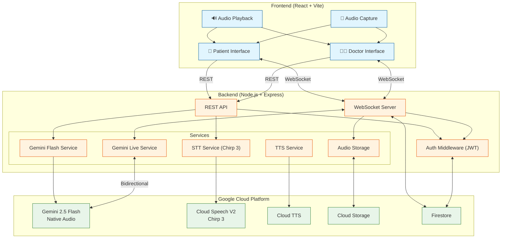
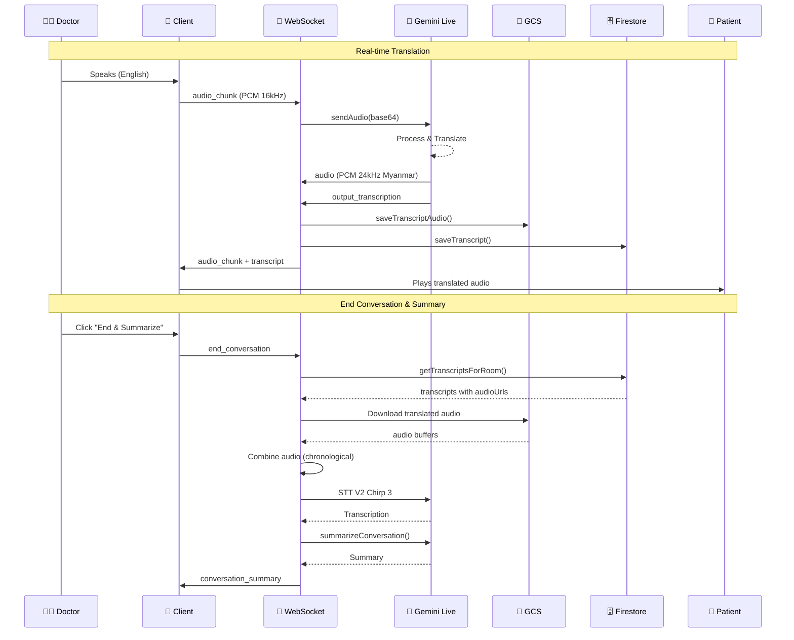
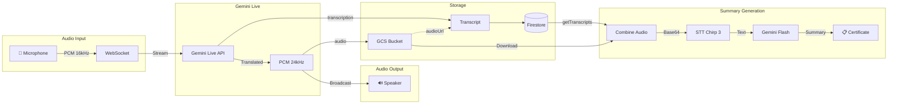

# MedInterpreter

Real-time bilingual medical interpreter powered by **Google Gemini Live API** and **Vertex AI**. Bridges language barriers between healthcare providers and patients in clinical settings with live audio translation, medical image analysis, consultation summaries, and medical certificate generation.

**Built by Min Khant Soe, SoeMindAI, Inc.**

> This is a communication support tool, NOT a medical device or diagnostic tool.

---

## Features

| Feature | Description |
|---|---|
| **Real-Time Voice Interpretation** | Gemini Live API with native audio — doctor speaks, patient hears translation instantly (and vice versa). Supports barge-in/interruption handling. |
| **Multi-Language Support** | English, Thai, Burmese, Khmer, Lao, Vietnamese, Chinese |
| **Medical Image Analysis** | Upload photos (rashes, wounds, X-rays) for AI-powered visual assessment with severity classification |
| **Prescription Scanner** | Photograph prescription labels — AI reads and explains medication in patient's language |
| **Consultation Summary** | AI-generated structured summary with Clinical Grounding Verification (two-model anti-hallucination check) |
| **Medical Certificate** | Generate bilingual PDF medical certificates from consultation data |
| **Room-Based Sessions** | Doctor creates a room, patient joins with 6-digit code. Real-time WebSocket communication. |
| **Session Completion** | Full workflow: Summary generation, clinical verification, doctor edits, certificate generation, PDF/print export |

---

## Quick Start

### Local Development (3 steps)

```bash
# 1. Clone and install
git clone <repo-url>
cd Live-Interpreter
npm install

# 2. Configure environment
cp server/.env.example server/.env
# Edit server/.env: Add GOOGLE_API_KEY and GOOGLE_CLOUD_PROJECT

# 3. Run
npm run dev
# Open http://localhost:5173 (client) — Server runs on port 8034
```

### Cloud Deployment (1 command)

```bash
cd server
./deploy.sh
# Auto-creates: Firestore, Artifact Registry, Secrets, Cloud Run service
# After deploy: npm run db:seed --workspace=server
```

See [Setup — Local Development](#setup--local-development) and [Setup — Production](#setup--production-google-cloud-run) for detailed instructions.

---

## Architecture

### System Overview



### Real-time Translation Flow



### Audio Pipeline



**Built on Google Cloud:**
- Gemini 2.5 Flash Native Audio for real-time voice translation
- Cloud Speech-to-Text V2 (Chirp 3) for accurate transcription
- Cloud Run for serverless deployment
- Firestore for session storage
- Cloud Storage for audio persistence
- WebSocket for low-latency streaming

---

## Tech Stack

| Layer | Technology |
|---|---|
| **Frontend** | React 19, TypeScript, Vite, Web Audio API |
| **Backend** | Express, TypeScript, WebSocket (ws) |
| **AI — Text** | Gemini 2.5 Flash (translate, summarize, certificates, image/Rx analysis) |
| **AI — Live Audio** | Gemini 2.5 Flash Native Audio (real-time voice interpretation via Live API) |
| **AI — Verification** | Gemini 3.1 Flash Lite (clinical grounding verification with thinking) |
| **Speech** | Google Cloud Text-to-Speech |
| **Database** | Google Cloud Firestore (NoSQL) |
| **Auth** | JWT + bcryptjs (cost 12) |
| **Deployment** | Google Cloud Run, Artifact Registry, GitHub Actions CI/CD |
| **Container** | Multi-stage Docker (Alpine, non-root user) |
| **Testing** | Vitest, @testing-library/react, jsdom |

---

## Prerequisites

- **Node.js 20+** and npm
- **Google Cloud project** with these APIs enabled:
  - Vertex AI API
  - Cloud Firestore API
  - Cloud Text-to-Speech API
- **Firestore database** created in your GCP project
- For local dev: [Firestore Emulator](https://firebase.google.com/docs/emulator-suite) (optional but recommended)
- For local dev: Gemini API key (from [Google AI Studio](https://aistudio.google.com/))

---

## Setup — Local Development

### 1. Clone and Install

```bash
git clone <repo-url>
cd Live-Interpreter

# Install all dependencies (root + client + server workspaces)
npm install
```

### 2. Environment Variables

```bash
cp server/.env.example server/.env
```

Edit `server/.env`:

```env
# Required for local dev (Gemini API key mode)
GOOGLE_API_KEY=your-gemini-api-key-here

# Required for Firestore
GOOGLE_CLOUD_PROJECT=your-gcp-project-id

# Optional — defaults to 8034
PORT=8034

# Optional — for Firestore emulator (recommended)
FIRESTORE_EMULATOR_HOST=localhost:8080
```

### 3. Database Setup (Firestore)

**Option A: Firestore Emulator (recommended for local dev)**

```bash
# Install Firebase tools if not already installed
npm install -g firebase-tools

# Start the Firestore emulator
firebase emulators:start --only firestore --project your-project-id

# In another terminal, seed mock data
export FIRESTORE_EMULATOR_HOST=localhost:8080
export GOOGLE_CLOUD_PROJECT=your-project-id
npm run db:seed
```

**Option B: Real Firestore**

```bash
# 1. Create a Firestore database in your GCP project (Native mode)
gcloud firestore databases create --location=us-central1

# 2. Authenticate locally
gcloud auth application-default login

# 3. Seed mock data
export GOOGLE_CLOUD_PROJECT=your-project-id
npm run db:seed --force
```

**Seed script options:**

```bash
npm run db:seed          # Create mock users, rooms, transcripts
npm run db:seed:clean    # Wipe all data first, then seed
npm run db:seed:dry      # Preview what would be created (no writes)
```

**Mock data created:**

| Collection | Documents | Details |
|---|---|---|
| `users` | 7 | 3 doctors + 4 patients |
| `rooms` | 5 | 3 active, 1 waiting, 1 closed |
| `rooms/{id}/transcripts` | 19 | Bilingual medical conversation entries |

**Test credentials (development only):**

| Role | Username | Password |
|---|---|---|
| Admin | `admin` | `admin123` |
| Doctor | `dr_smith` | `doctor123` |
| Doctor | `dr_chen` | `doctor123` |
| Doctor | `dr_tanaka` | `doctor123` |
| Patient | `patient_aung` | `patient123` |
| Patient | `patient_thida` | `patient123` |
| Patient | `patient_zaw` | `patient123` |

> **Note:** These are demo credentials for local development only. Never use these in production.

### 4. Firestore Collections Schema

```
Firestore (NoSQL)
│
├── users/                          # User accounts
│   └── {auto-id}
│       ├── username: string        # Unique
│       ├── passwordHash: string    # bcryptjs, cost 12
│       ├── role: "doctor" | "patient"
│       └── createdAt: Timestamp
│
├── rooms/                          # Consultation rooms
│   └── {auto-id}
│       ├── code: string            # 6-digit room code (000000–999999)
│       ├── doctorUsername: string | null
│       ├── patientUsername: string | null
│       ├── doctorLang: string      # "en", "th", "my", "km", "lo", "vi", "zh"
│       ├── patientLang: string
│       ├── status: "waiting" | "active" | "closed"
│       ├── createdAt: Timestamp
│       │
│       └── transcripts/            # Subcollection — conversation log
│           └── {auto-id}
│               ├── id: string
│               ├── role: "doctor" | "patient"
│               ├── original: string
│               ├── translated: string
│               ├── originalLang: string
│               ├── translatedLang: string
│               ├── timestamp: number
│               └── savedAt: Timestamp
```

### 5. Start Development Server

```bash
# Start both client and server with hot reload
npm run dev

# Server: http://localhost:8034      (Express API + WebSocket)
# Client: http://localhost:5173      (Vite dev server with HMR)
```

### 6. Run Tests

```bash
# Run all tests (server + client)
npm test -w server && npm test -w client

# Watch mode
npm run test:watch -w server
npm run test:watch -w client
```

**Test coverage: 62 tests total**

| Suite | Tests | File |
|---|---|---|
| Server — Gemini utils | 18 | `server/src/__tests__/gemini.test.ts` |
| Server — Error handler | 13 | `server/src/__tests__/errorHandler.test.ts` |
| Server — Rate limiter | 7 | `server/src/__tests__/rateLimiter.test.ts` |
| Client — Types | 4 | `client/src/__tests__/types.test.ts` |
| Client — Disclaimer | 5 | `client/src/__tests__/Disclaimer.test.tsx` |
| Client — LanguageSetup | 8 | `client/src/__tests__/LanguageSetup.test.tsx` |
| Client — TranscriptPanel | 7 | `client/src/__tests__/TranscriptPanel.test.tsx` |

---

## Setup — Production (Google Cloud Run)

### Option A: Automated (GitHub Actions CI/CD)

The repository includes a GitHub Actions pipeline (`.github/workflows/deploy.yml`) that automatically builds, tests, and deploys on every push to `main`.

**1. Set GitHub Secrets:**

| Secret | Value |
|---|---|
| `GCP_PROJECT_ID` | Your Google Cloud project ID |
| `GCP_SA_KEY` | Service account JSON key (needs Cloud Run Admin, Artifact Registry Writer, Vertex AI User) |
| `GCP_REGION` | _(optional)_ Defaults to `us-central1` |

**2. Push to main:**

```bash
git push origin main
# CI/CD pipeline: Test → Build Docker → Push to Artifact Registry → Deploy to Cloud Run → Health check
```

### Option B: Manual Deploy (Recommended for Hackathon)

```bash
# One-command deploy — auto-creates all resources and deploys to Cloud Run
cd server
./deploy.sh
```

The script automatically:
1. Checks prerequisites (gcloud CLI, authentication)
2. Enables required GCP APIs (Cloud Run, Firestore, Secret Manager, Artifact Registry, etc.)
3. Creates Artifact Registry repository if needed
4. Creates secrets (GOOGLE_API_KEY, JWT_SECRET) in Secret Manager if they don't exist
5. Sets up Firestore database in native mode if needed
6. Builds Docker image and pushes to Artifact Registry
7. Deploys to Cloud Run with HTTPS and all required IAM bindings

**After deployment:**
```bash
# Seed the database with test accounts
npm run db:seed --workspace=server
```

**Or step by step:**

```bash
# 1. Authenticate
gcloud auth login
gcloud config set project YOUR_PROJECT_ID

# 2. Enable APIs
gcloud services enable \
  run.googleapis.com \
  artifactregistry.googleapis.com \
  texttospeech.googleapis.com \
  aiplatform.googleapis.com \
  firestore.googleapis.com

# 3. Create Firestore database (if not exists)
gcloud firestore databases create --location=us-central1

# 4. Build and push Docker image
IMAGE="us-central1-docker.pkg.dev/YOUR_PROJECT_ID/med-interpreter-repo/med-interpreter:$(git rev-parse --short HEAD)"
docker build -t "$IMAGE" .
docker push "$IMAGE"

# 5. Deploy to Cloud Run
gcloud run deploy med-interpreter \
  --image "$IMAGE" \
  --platform managed \
  --region us-central1 \
  --allow-unauthenticated \
  --port 8080 \
  --memory 1Gi \
  --cpu 2 \
  --min-instances 1 \
  --max-instances 10 \
  --timeout 300 \
  --session-affinity \
  --set-env-vars "NODE_ENV=production,USE_VERTEX_AI=true"
```

### Cloud Run — What's Auto-Configured

On Cloud Run, these environment variables are **automatically injected** — no `.env` file needed:

| Variable | Source | Purpose |
|---|---|---|
| `PORT` | Cloud Run (auto) | Server listen port |
| `GOOGLE_CLOUD_PROJECT` | Cloud Run (auto) | Firestore + Vertex AI project |
| Application Default Credentials | Service account (auto) | Auth for all GCP APIs |
| `USE_VERTEX_AI=true` | Set in deploy script | Switches from API key to Vertex AI |

**IAM roles needed** for the Cloud Run service account:

| Role | Purpose |
|---|---|
| `roles/aiplatform.user` | Vertex AI (Gemini) API access |
| `roles/datastore.user` | Firestore read/write |
| `roles/cloudtts.client` | Cloud Text-to-Speech |

---

## Project Structure

```
Live-Interpreter/
├── client/                          # React frontend (Vite)
│   ├── public/
│   │   ├── audio-processor.js       # AudioWorklet for PCM streaming
│   │   └── soemindai-logo.png       # Favicon
│   ├── src/
│   │   ├── components/
│   │   │   ├── LoginPage.tsx         # Auth (login / register)
│   │   │   ├── RoomPage.tsx          # Create / join room
│   │   │   ├── LanguageSetup.tsx     # Language pair selection
│   │   │   ├── InterpreterView.tsx   # Main interpreter (audio, text, images)
│   │   │   ├── TranscriptPanel.tsx   # Conversation transcript display
│   │   │   ├── SessionCompleteModal.tsx # Summary → verify → certificate flow
│   │   │   ├── SummaryView.tsx       # Bilingual summary view
│   │   │   ├── CertificateView.tsx   # Medical certificate form + preview
│   │   │   ├── PrescriptionScanner.tsx # Rx photo analysis
│   │   │   ├── Disclaimer.tsx        # Safety disclaimer modal
│   │   │   └── LegalPage.tsx         # Terms of use, privacy policy
│   │   ├── hooks/
│   │   │   ├── useWebSocket.ts       # WebSocket connection + room management
│   │   │   └── useAudioStreamer.ts   # Audio capture + PCM streaming
│   │   ├── __tests__/               # Component + unit tests
│   │   ├── styles/globals.css        # All styles (5-tier responsive)
│   │   ├── types.ts                  # Shared TypeScript types
│   │   ├── App.tsx                   # App root + routing
│   │   └── main.tsx                  # Entry point
│   ├── index.html
│   ├── vite.config.ts
│   ├── tsconfig.json
│   └── vitest.config.ts
│
├── server/                           # Express backend
│   ├── src/
│   │   ├── index.ts                  # Server entry (Express + HTTP + WS)
│   │   ├── websocket.ts             # WebSocket handler (rooms, audio, images)
│   │   ├── types.ts                  # Shared TypeScript types
│   │   ├── services/
│   │   │   ├── gemini.ts            # Gemini 2.5 Flash (text API + Vertex AI)
│   │   │   ├── geminiLive.ts        # Gemini Live API (real-time audio sessions)
│   │   │   ├── firestore.ts         # Firestore (users, rooms, transcripts)
│   │   │   └── tts.ts              # Google Cloud Text-to-Speech
│   │   ├── routes/
│   │   │   ├── auth.ts              # POST /api/auth/login, /register
│   │   │   ├── rooms.ts            # POST /api/rooms/create, /join
│   │   │   ├── summary.ts          # POST /api/summary
│   │   │   ├── prescription.ts     # POST /api/prescription
│   │   │   ├── certificate.ts      # POST /api/certificate
│   │   │   └── consultation.ts     # POST /api/consultation/summary, /verify
│   │   ├── middleware/
│   │   │   ├── auth.ts             # JWT authentication middleware
│   │   │   ├── rateLimiter.ts      # HTTP + WebSocket rate limiting
│   │   │   └── errorHandler.ts     # Gemini error classification
│   │   └── __tests__/              # Server tests
│   ├── scripts/
│   │   └── seed.ts                 # Database seed script
│   ├── deploy.sh                    # Cloud Run deploy script (auto-creates resources)
│   ├── tsconfig.json
│   └── vitest.config.ts
│
├── docs/
│   └── hallucination-risks.md       # AI hallucination risk catalog
│
├── .github/workflows/
│   └── deploy.yml                   # CI/CD pipeline (test → deploy)
│
├── Dockerfile                        # Multi-stage build (Alpine, non-root)
├── .env.example                     # Environment variable template
├── package.json                     # Workspace root (npm workspaces)
└── LICENSE                          # MIT — Min Khant Soe, SoeMindAI, Inc.
```

---

## API Endpoints

| Method | Endpoint | Auth | Description |
|---|---|---|---|
| `POST` | `/api/auth/register` | No | Create user account |
| `POST` | `/api/auth/login` | No | Login, returns JWT |
| `POST` | `/api/rooms/create` | JWT | Doctor creates room (returns 6-digit code) |
| `POST` | `/api/rooms/join` | JWT | Patient joins room by code |
| `GET` | `/api/rooms/:code` | JWT | Get room details |
| `POST` | `/api/summary` | JWT | Generate bilingual visit summary |
| `POST` | `/api/prescription` | JWT | Analyze prescription photo |
| `POST` | `/api/certificate` | JWT | Generate bilingual medical certificate |
| `POST` | `/api/consultation/summary` | JWT | Generate structured consultation summary |
| `POST` | `/api/consultation/verify` | JWT | Clinical grounding verification |
| `GET` | `/api/health` | No | Health check |
| `WS` | `/ws/interpret` | JWT (in message) | Real-time audio/text/image communication |

---

## AI Models Used

| Model | Purpose | Temperature | Output |
|---|---|---|---|
| **Gemini 2.5 Flash** | Translation, transcription, summaries, certificates, image/Rx analysis | 0.1–0.2 | Structured JSON |
| **Gemini 2.5 Flash Native Audio** | Real-time voice interpretation via Live API | Default | Audio + text |
| **Gemini 3.1 Flash Lite** | Clinical Grounding Verification (anti-hallucination) | 0.1 | Structured JSON |

---

## Security

- **Prompt injection defense**: `sanitizeForPrompt()` + `<DATA>` tag wrapping on all user input
- **Auth**: JWT tokens with bcryptjs password hashing (cost 12)
- **Rate limiting**: HTTP (sliding window) + WebSocket (per-connection)
- **CORS**: Origin restriction in production
- **Docker**: Non-root user, `npm ci` + `npm prune`
- **PHI cleanup**: Transcript data cleared from memory on disconnect
- **Timeouts**: 30s timeout on all Gemini API calls via `withTimeout()`

---

## Hallucination Mitigation

See [`docs/hallucination-risks.md`](docs/hallucination-risks.md) for the full catalog. Key measures:

1. **Prompt engineering** — grounding rules, low temperature, structured JSON output
2. **Clinical Grounding Verification** — second AI model (Gemini 3.1 Flash Lite) cross-references summaries against original transcripts
3. **Human review** — doctor edits every field before certificate generation
4. **Output labeling** — disclaimers, `[?]` uncertainty markers, image quality warnings

---

## Disclaimer

This application is a **communication support tool** designed to assist with language barriers in medical settings. It is:
- NOT a certified medical interpreter
- NOT a medical device or diagnostic tool
- NOT a substitute for professional medical interpretation

All translations should be verified by qualified personnel. If you are experiencing a medical emergency, call your local emergency number immediately.

---

## License

MIT License — Copyright (c) 2026 Min Khant Soe — CEO, SoeMindAI, Inc.
